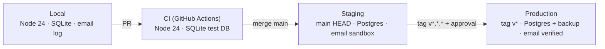

# PRD-0000 — Platform & Environment Setup (Invoicing MVP)

| Meta | Nilai |
|------|-------|
| ID | PRD-0000 |
| Versi | 1.4 · Phase 1 implementasi selesai · PG-1 formal terbuka (GitHub plan/repo) |
| Development phase | [PRD_platform_setup_development_phase.md](./PRD_platform_setup_development_phase.md) |
| Tanggal | 2026-09-30 (verifikasi PG-0 & PG-1) |
| Owner | Product (Cursor, PM) |
| Reviewer | Engineering lead, Design |
| Sumber | [ARCHITECTURE.md](../invoicing/ARCHITECTURE.md) v1.5 · [TECHNOLOGY-STACK.md](../invoicing/engineering/TECHNOLOGY-STACK.md) v1.2 · [DESIGN-GUIDELINES.md](../invoicing/design/DESIGN-GUIDELINES.md) v1.1 · [ARCHITECTURE-ALIGNMENT.md](../invoicing/brd/ARCHITECTURE-ALIGNMENT.md) v2.0 |

> **Batas PRD:** dokumen ini hanya mengatur **platform, environment, tooling, pipeline, dan design-system pipeline**. **Tidak ada pengembangan fitur** (FR-01–FR-13) maupun perubahan business rule (BR-01–BR-06). Gap fitur di [alignment §6](../invoicing/brd/ARCHITECTURE-ALIGNMENT.md#6-register-gap-dokumen--kode) (G-01, G-02, G-03, G-08, G-10, G-11, G-13) **di luar scope**.

---

## 1. Latar belakang

Kode MVP invoicing (web, API, domain, database) sudah lolos gate otomatis G0–G5. **Milestone M0 (Phase 0)** menutup baseline lokal: Node 24 ter-pin, satu lockfile npm, SQLite canonical, env example lengkap, `npm run setup` / `npm run verify`, dan runbook dev. **Phase 1 (M1):** workflow CI & `npm run verify` sudah di repo; run GitHub dan branch protection **belum memenuhi PG-1** (lihat §1.3). Staging/prod dan validasi env saat boot = Phase 2.

### 1.1 Baseline awal (hasil pemeriksaan 2026-09-29)

| # | Area | Kondisi saat ini | Dampak |
|---|------|------------------|--------|
| B-01 | Runtime | Node lokal **v20.20.2**; `engines` monorepo `>=24.3.0`; tidak ada `.nvmrc` | Perilaku dev ≠ CI/prod; `remix/node-tsx` & API Node 24 berisiko |
| B-02 | Package manager | 4 lockfile: `package-lock.json`, `yarn.lock` (root) + `apps/web/package-lock.json`, `apps/web/yarn.lock` | Instalasi tidak deterministik; dependency drift |
| B-03 | CI | Git root = `Agentic/`, tetapi `ci.yml` memakai `working-directory: Agentic` dan `cache-dependency-path: Agentic/package-lock.json` | Workflow gagal di GitHub Actions |
| B-04 | CI coverage | `ci.yml`: migrate, test:domain, typecheck, gate. Tanpa `css:build`, `npm test` (web), `design:css` | Regressi CSS/router tidak terdeteksi (G-09) |
| B-05 | Database lokal | Dua file SQLite: `packages/database/prisma/dev.db` dan `packages/database/prisma/prisma/dev.db`; `DATABASE_URL` relatif berbeda di tiap `.env` | Migrasi & runtime bisa menulis ke DB berbeda |
| B-06 | Env | `.env.example` tidak memuat `SESSION_SECRET`, `APP_URL`, `EMAIL_*`, `CORS_ORIGIN`, `NODE_ENV`; tidak ada validasi env saat boot | Onboarding manual; error runtime di production (G-12) |
| B-07 | Database prod | `schema.prisma` hard-coded `provider = "sqlite"`; belum ada strategi PostgreSQL | Tidak bisa deploy staging/prod sesuai ARCH §13 |
| B-08 | Email | Log adapter default; belum ada akun/domain provider | Staging tidak bisa uji kirim nyata (G-04) |
| B-09 | Observability | API pakai `remix/middleware/logger` (teks); web tanpa logger; tanpa `requestId` | Tidak memenuhi ARCH §14.2/§14.5 (G-06) |
| B-10 | Design pipeline | Token design di `docs/design/prototype/src/tailwind.css`; `apps/web/app/styles/app.css` hanya `--color-brand` | Dua sumber style; UI app menyimpang dari guideline (G-07) |
| B-11 | Repo hygiene | Repo belum punya commit; folder `ui-prototype/` kosong; `.DS_Store` tercecer | Branch protection & CI belum bisa diaktifkan |
| B-12 | Staging/prod | Belum ada host, domain, TLS, secret store, backup | Phase 6 (release readiness) terblokir |

**Pemetaan baseline → task:** lihat [development phase §Baseline](./PRD_platform_setup_development_phase.md#pemetaan-baseline-prd--task).

### 1.2 Status setelah Phase 0 (verifikasi 2026-09-30)

| # | Area | Status | Bukti / catatan |
|---|------|--------|-----------------|
| B-01 | Runtime | **Selesai (Phase 0)** | `.nvmrc` / `.node-version` = 24.3.0 · `.npmrc` `engine-strict=true` · `npm ci` gagal di Node 20 (`EBADENGINE`) · sukses di Node 24.3.0 |
| B-02 | Package manager | **Selesai (Phase 0)** | Hanya `package-lock.json` di root; `yarn.lock` dihapus |
| B-03 | CI path | **Selesai (Phase 1)** | `ci.yml` root `Agentic/` · cache `package-lock.json` |
| B-04 | CI coverage | Sebagian (Phase 1) | Workflow = `verify` (PS-23); **runner GitHub belum jalan** (`startup_failure`) · paritas lokal OK |
| B-05 | Database lokal | **Selesai (Phase 0)** | Satu `packages/database/prisma/dev.db` · `DATABASE_URL=file:./dev.db` di semua `.env.example` |
| B-06 | Env | Sebagian | `.env.example` lengkap (PS-09); validasi boot = Phase 2 (`000001-be-env-validation`) |
| B-07–B-12 | Staging/prod, email, observability, design token app | Terbuka | Phase 2–3 |

**Gate PG-0:** lulus (2026-09-30) · remote https://github.com/Inoeng85/invoicing-agentic

### 1.3 Status setelah Phase 1 (verifikasi 2026-09-30)

| Cek | Hasil | Bukti |
|-----|--------|--------|
| PS-22 `ci.yml` path & cache | **Lulus (repo)** | Tanpa `working-directory: Agentic` · `cache-dependency-path: package-lock.json` |
| PS-24 Node dari `.nvmrc` | **Lulus (repo)** | `setup-node` · `node-version-file: .nvmrc` |
| PS-23 / PS-43 `npm run verify` | **Lulus (repo + lokal)** | Step CI = `verify`; lokal dengan env CI exit 0 · gate G0–G5 PASS |
| PS-22 run GitHub hijau | **Gagal** | Semua run `startup_failure` (job `verify` tidak start) · contoh run [36661916437](https://github.com/Inoeng85/invoicing-agentic/actions/runs/36661916437) |
| PS-05 branch protection | **Terblokir** | API: *Upgrade to GitHub Pro or make this repository public* (repo private, akun Free) |

**Gate PG-1:** **belum lulus formal** — 2/3 task Phase 1 selesai di kode; tutup PG-1 dengan (a) repo **public** atau **GitHub Pro**, (b) CI hijau, (c) rule `main` + required check `verify`.

---

## 2. Tujuan & non-goals

### 2.1 Tujuan

| ID | Tujuan | Ukuran keberhasilan |
|----|--------|---------------------|
| O-1 | Developer baru bisa menjalankan web + API lokal dengan satu alur | Clone → app jalan di `:44100`/`:44101` **≤ 15 menit**, tanpa Docker |
| O-2 | Environment deterministik di semua tahap | Node 24.x + satu lockfile npm di lokal, CI, staging, prod |
| O-3 | Setiap PR terverifikasi otomatis | CI hijau wajib sebelum merge ke `main` |
| O-4 | Staging & produksi siap menerima deploy | `GET /api/health/ready` 200 di staging dan prod |
| O-5 | Satu sumber design token | Prototype dan `apps/web` membangun dari token yang sama |

### 2.2 Non-goals

- Implementasi atau perubahan fitur FR-01–FR-13 dan BR-01–BR-06.
- Penutupan gap fitur G-01, G-02, G-03, G-08, G-10, G-11, G-13.
- CSRF, rate limit, dan `noindex` di level aplikasi (G-05) — PRD ini hanya menyiapkan **infrastruktur** (reverse proxy, konfigurasi) yang dibutuhkan.
- Redesign UI; PRD ini hanya menyiapkan **pipeline token**, bukan mengubah layar.
- Docker sebagai syarat wajib dev (ARCH §4 prinsip 1). Container boleh untuk hosting.
- Observability penuh (Prometheus/OpenTelemetry) — post-MVP (ARCH §14.4).

---

## 3. Pengguna platform

| Persona | Kebutuhan |
|---------|-----------|
| Developer (solo / tim kecil) | Setup cepat, perintah konsisten, error env yang jelas |
| Reviewer PR | CI yang andal, hasil gate terbaca |
| Ops / release owner | Deploy staging otomatis, prod via tag, rollback jelas |
| Designer / FE | Build prototype & token tanpa setup berat |
| QA | Staging dengan data demo dan email sandbox untuk UAT |

---

## 4. Environment target

| Aspek | Local | CI | Staging | Production |
|-------|-------|----|---------|------------|
| Sumber | Working copy | PR / push | `main` HEAD | Tag `v*.*.*` |
| Node | 24.x (`.nvmrc`) | 24.x | 24.x | 24.x |
| DB | SQLite file | SQLite ephemeral | PostgreSQL managed | PostgreSQL managed + snapshot harian |
| Migrasi | `prisma migrate dev` | `migrate deploy` ke DB test | `migrate deploy` saat deploy | `migrate deploy` setelah approval |
| Email | Log adapter | Log adapter | Provider sandbox / allowlist penerima | Provider, domain SPF/DKIM verified |
| Secret | `.env` lokal (gitignored) | GitHub Actions secrets (jika perlu) | Secret store host, scope staging | Secret store host, scope prod |
| TLS | — | — | Ya (host / reverse proxy) | Ya |
| Data | Seed demo | Fixture gate | Seed demo tanpa PII | Data nyata |

Rujukan: ARCH §13 (deployment), §16.4 (env ↔ branch), TECH-STACK §6.

---

## 5. Requirements

Prioritas: **P0** = wajib sebelum tim mulai kerja paralel / CI aktif · **P1** = wajib sebelum staging · **P2** = wajib sebelum production.

### 5.1 Toolchain & runtime

| ID | Requirement | Prioritas | Acceptance criteria |
|----|-------------|-----------|---------------------|
| PS-01 | Pin Node 24 LTS-line (≥ 24.3) lewat `.nvmrc` (dan `.node-version`) di root | P0 | `nvm use` memilih 24.x; versi sama dengan `setup-node` di CI |
| PS-02 | Tegakkan `engines` saat install (`engine-strict=true` di `.npmrc`) | P0 | `npm ci` gagal di Node < 24.3 dengan pesan jelas |
| PS-03 | npm workspaces sebagai **satu-satunya** package manager; satu `package-lock.json` di root | P0 | `yarn.lock` (root & `apps/web`) dan `apps/web/package-lock.json` dihapus; `npm ci` dari root sukses |
| PS-04 | Versi dependensi dev inti di-pin (bukan `latest`) untuk `typescript`, `@types/node` | P1 | `package.json` tanpa `latest`; typecheck reproducible |

### 5.2 Repository hygiene

| ID | Requirement | Prioritas | Acceptance criteria |
|----|-------------|-----------|---------------------|
| PS-05 | Initial commit + remote (Phase 0); branch `main` dilindungi — PR wajib, CI hijau (Phase 1, setelah PG-1) | P0 | Sesuai ARCH §16.2 · task `000003-stack-*` + `000001-infra-github-repo-protection` |
| PS-06 | `.gitignore` mencakup `.DS_Store`, `*.db`, `.env*` kecuali `.env.example`, artefak build CSS yang di-generate | P0 | `git status` bersih setelah `npm run setup` + `npm run dev` |
| PS-07 | Bersihkan artefak tak terpakai (`ui-prototype/` kosong, `prisma/prisma/dev.db`) | P0 | Folder/file hilang; tidak ada referensi tersisa |
| PS-08 | Konvensi branch & commit terdokumentasi (`feature/*`, `fix/*`, SemVer tag) | P1 | README kontribusi merujuk ARCH §16 |

### 5.3 Konfigurasi & secrets

| ID | Requirement | Prioritas | Acceptance criteria |
|----|-------------|-----------|---------------------|
| PS-09 | `.env.example` lengkap per app/package: `DATABASE_URL`, `PORT`, `NODE_ENV`, `SESSION_SECRET`, `APP_URL`, `CORS_ORIGIN`, `API_BASE_URL`, `EMAIL_PROVIDER`, `EMAIL_API_KEY`, `EMAIL_FROM` | P0 | Semua variabel TECH-STACK §5 ada, dengan komentar wajib/opsional per env |
| PS-10 | Validasi env saat boot (web & API): variabel wajib hilang → proses berhenti dengan pesan yang menyebut nama variabel | P1 | Start production tanpa `SESSION_SECRET` gagal dengan pesan eksplisit (perilaku domain saat ini dipertahankan dan diperluas) |
| PS-11 | Secret per environment di secret store host; staging ≠ prod; tidak ada secret di image/repo | P1 | Audit: `git grep` tidak menemukan secret; image tidak memuat `.env` (ARCH §15.4) |
| PS-12 | Prosedur rotasi `SESSION_SECRET` & API key email terdokumentasi | P2 | Runbook ada; rotasi diuji sekali di staging |

### 5.4 Database

| ID | Requirement | Prioritas | Acceptance criteria |
|----|-------------|-----------|---------------------|
| PS-13 | Satu path SQLite canonical untuk dev (mis. absolut via root script atau relatif ke `schema.prisma`) dipakai migrate **dan** runtime web/API | P0 | Hanya satu file `dev.db`; data yang dibuat via web terlihat di Prisma Studio |
| PS-14 | Perintah DB standar dari root: `db:migrate`, `db:reset`, `db:seed`, `db:studio` | P0 | Semua jalan dari `Agentic/` |
| PS-15 | Seed demo (1 user, profil bisnis, 3–4 klien, invoice berbagai status) selaras sample data prototype (Studio Kartika) | P1 | `npm run db:seed` idempoten; dipakai di staging untuk UAT |
| PS-16 | Strategi PostgreSQL untuk staging/prod (lihat Q-01), termasuk migrasi yang kompatibel | P1 | `prisma migrate deploy` sukses ke Postgres staging; gate G0–G5 lulus terhadap Postgres |
| PS-17 | Backup harian prod + uji restore; RPO 24 jam | P2 | Restore ke DB sementara berhasil dan `health/ready` 200 |

### 5.5 Pengalaman dev lokal

| ID | Requirement | Prioritas | Acceptance criteria |
|----|-------------|-----------|---------------------|
| PS-18 | `npm run setup` di root: cek Node, install, salin `.env.example` → `.env` bila belum ada, generate `SESSION_SECRET` dev, migrate; `db:seed` no-op atau minimal hingga PS-15 (Phase 2) | P0 | Dari clone bersih, `npm run setup && npm run dev` membuka web `:44100` dan API `:44101` |
| PS-19 | `npm run doctor`: diagnosa Node, lockfile, env wajib, DB reachable, port bebas | P1 | Output PASS/FAIL per cek, exit code ≠ 0 bila ada FAIL |
| PS-20 | `npm run verify` = urutan yang sama dengan CI (typecheck, test:domain, test web, css:build, design:css, gate) | P0 | Hasil lokal = hasil CI · memenuhi PS-43 bila CI memanggil `verify` |
| PS-21 | Port & URL dev terdokumentasi (web 44100, API 44101, prototype server) | P0 | Tertulis di STACK-INTEGRATION dan README root |

### 5.6 Continuous Integration

| ID | Requirement | Prioritas | Acceptance criteria |
|----|-------------|-----------|---------------------|
| PS-22 | Perbaiki `ci.yml` agar sesuai git root (hapus `working-directory: Agentic`, perbaiki `cache-dependency-path`) | P0 | Workflow hijau di PR pertama |
| PS-23 | CI menjalankan `npm run verify` (PS-20, sudah termasuk `design:css`) | P0 | Menutup G-09; job gagal bila salah satu langkah gagal |
| PS-24 | Node di CI dibaca dari `.nvmrc` (`node-version-file`) | P0 | Tidak ada versi Node ganda di konfigurasi |
| PS-25 | CI job < 10 menit dengan cache npm | P1 | Median durasi tercatat di 5 run terakhir |
| PS-26 | Artefak gate (log PASS/FAIL) terlampir di summary job | P2 | Reviewer bisa membaca hasil gate tanpa membuka log mentah |

### 5.7 CD & hosting

| ID | Requirement | Prioritas | Acceptance criteria |
|----|-------------|-----------|---------------------|
| PS-27 | Pilih host (Q-02) yang mendukung Node 24, dua proses (web, API), Postgres managed, secret store, TLS | P1 | Keputusan tercatat sebagai ADR |
| PS-28 | Deploy staging otomatis dari `main`: build → `css:build` → `prisma migrate deploy` → start → smoke `GET /api/health/ready` | P1 | Merge ke `main` menghasilkan staging hijau tanpa langkah manual |
| PS-29 | Deploy production dari tag `v*.*.*` dengan approval manual | P2 | Sesuai ARCH §15.3 |
| PS-30 | Rollback: redeploy build sebelumnya; kebijakan migrasi mundur terdokumentasi | P2 | Rollback diuji sekali di staging |
| PS-31 | Domain & TLS: `APP_URL` staging/prod mengarah ke HTTPS; API di subdomain atau path dengan `CORS_ORIGIN` benar | P1 | Link publik `/i/:token` di email staging bisa dibuka |
| PS-32 | Reverse proxy siap untuk rate limit `/i/:token` (kebijakan aplikasinya di G-05) | P2 | Konfigurasi proxy mendukung limit per IP |

### 5.8 Observability baseline

| ID | Requirement | Prioritas | Acceptance criteria |
|----|-------------|-----------|---------------------|
| PS-33 | Log terstruktur JSON ke stdout untuk web & API dengan field ARCH §14.2 (`requestId`, `method`, `path`, `status`, `durationMs`) | P1 | Contoh log staging dapat di-query per `requestId` (G-06) |
| PS-34 | Propagasi `X-Request-Id` (terima atau generate) di web & API | P1 | Header ada di setiap respons |
| PS-35 | Health check host memakai `/api/health/live` & `/api/health/ready` | P1 | Host menandai instance unhealthy saat DB mati |
| PS-36 | Alert: ready gagal > 2 menit, 5xx > 5% / 5 menit (ARCH §14.6) | P2 | Alert uji terkirim ke channel owner |
| PS-37 | Retensi log 30 hari | P2 | Konfigurasi host terverifikasi |

### 5.9 Layanan eksternal — email

| ID | Requirement | Prioritas | Acceptance criteria |
|----|-------------|-----------|---------------------|
| PS-38 | Akun provider email (Resend — D-08) untuk staging & prod, API key terpisah | P1 | Key tersimpan di secret store per env |
| PS-39 | Domain pengirim terverifikasi (SPF, DKIM, DMARC) untuk prod; staging memakai sandbox/allowlist penerima | P1 (staging) / P2 (prod) | Email staging hanya sampai ke alamat allowlist QA |
| PS-40 | Pemilihan adapter via env (`EMAIL_PROVIDER=log|resend`) memakai titik ekstensi `setEmailSender` yang sudah ada | P1 | Default `log` di local/CI; tidak mengubah logic `sendInvoice` |

### 5.10 Design system pipeline

| ID | Requirement | Prioritas | Acceptance criteria |
|----|-------------|-----------|---------------------|
| PS-41 | Satu sumber token: blok `:root`, `.dark`, `@theme inline`, `@layer components` diekstrak ke file bersama (mis. `packages/design-tokens/tokens.css` atau `docs/design/prototype/src/tokens.css`) | P1 | Prototype dan `apps/web/app/styles/app.css` meng-import file yang sama (D-10) |
| PS-42 | `apps/web` build CSS dengan token tersebut tanpa mengubah markup layar (penerapan ke layar = pekerjaan fitur terpisah) | P1 | `npm run css:build` sukses; ukuran `public/app.css` tercatat; tampilan halaman yang ada tidak rusak |
| PS-43 | `design:css` dan `css:build` masuk CI | P0 | Terpenuhi lewat `npm run verify` (PS-20) + PS-23; build gagal → CI merah |
| PS-44 | Prototype bisa dibuka via satu perintah (`npm run design:serve`) | P2 | Server statis lokal pada port terdokumentasi |
| PS-45 | Dark mode tetap nonaktif di app (D-11); token `.dark` hanya dipakai prototype | P1 | Tidak ada toggle dark di `apps/web` |

### 5.11 Dokumentasi platform

| ID | Requirement | Prioritas | Acceptance criteria |
|----|-------------|-----------|---------------------|
| PS-46 | [STACK-INTEGRATION.md](../invoicing/engineering/STACK-INTEGRATION.md) menjadi runbook dev canonical (setup, doctor, verify, DB, prototype) | P0 | Developer baru mengikuti tanpa bantuan (diuji 1 orang) |
| PS-47 | Runbook ops: deploy, rollback, rotasi secret, restore backup | P2 | Ada di `docs/0000_platform_setup/` |
| PS-48 | ADR untuk keputusan Q-01…Q-04 | P1 | Satu file per keputusan, status Accepted |

---

## 6. Non-functional requirements

| NFR | Target |
|-----|--------|
| Waktu onboarding | Clone → app jalan ≤ 15 menit (koneksi normal) |
| Reproducibility | `npm ci` di dua mesin menghasilkan tree dependensi identik |
| Durasi CI | < 10 menit per run |
| Deploy staging | < 15 menit dari merge ke health ready |
| Keamanan | Tidak ada secret di repo/image; staging & prod terisolasi |
| Portabilitas | Dev tanpa Docker (macOS & Linux); container opsional untuk hosting |
| Paritas | Node major sama di semua env; skema DB sama (lewat migrasi) |

---

## 7. Milestone, gate & development phase

**Eksekusi detail:** [PRD_platform_setup_development_phase.md](./PRD_platform_setup_development_phase.md) (38 task, format `0000yy-[kanonik]-task`).

| Milestone | Fase dev | Isi (requirement) | Gate pass |
|-----------|----------|-------------------|-----------|
| **M0 — Local baseline** | Phase 0 | PS-01–PS-03, PS-05 (commit/remote), PS-06–PS-07, PS-09, PS-13–PS-14, PS-18, PS-20–PS-21, PS-46 | **PG-0:** ✅ lokal 2026-09-30 (`npm run setup && npm run verify`, satu lockfile, satu `dev.db`) · ⏳ push remote |
| **M1 — CI** | Phase 1 | PS-05 (branch protection), PS-22–PS-24, PS-43 (via verify) | **PG-1:** ⏳ implementasi ✅ · run CI + proteksi `main` (butuh public/Pro) |
| **M2 — Staging** | Phase 2 | PS-04, PS-08, PS-10–PS-11, PS-15–PS-16, PS-19, PS-25, PS-27–PS-28, PS-31, PS-33–PS-35, PS-38–PS-42, PS-45, PS-48 | **PG-2:** merge → staging otomatis; `/api/health/ready` 200 di Postgres; gate G0–G5 lulus terhadap staging DB; email sandbox diterima QA |
| **M3 — Production readiness** | Phase 3 | PS-12, PS-17, PS-26, PS-29–PS-30, PS-32, PS-36–PS-37, PS-39 (prod), PS-44, PS-47 | **PG-3:** tag `v0.1.0-rc` deploy ke prod-like; restore & rollback teruji; alert teruji |

### 7.1 Urutan eksekusi task (ringkas)

| Fase | Urutan task (disarankan) |
|------|---------------------------|
| 0 | `000001-stack-pin-node-runtime` → `000002-stack-single-npm-lockfile` → `000003-stack-repo-hygiene` → `000001-db-canonical-sqlite-path` → `000004-stack-env-example` → `000002-db-root-scripts` → `000005-stack-setup-script` → `000006-stack-verify-script` → `000001-docs-dev-runbook` |
| 1 | `000001-infra-github-repo-protection` → `000002-infra-ci-workflow-fix` → `000003-infra-ci-verify-pipeline` |
| 2 | `000002-docs-adr-platform-decisions` → `000003-docs-branch-commit-convention` → `000007-stack-pin-dev-dependencies` → `000004-db-postgres-strategy` → `000001-be-env-validation` → `000002-be-structured-logging-request-id` → `000003-be-email-adapter-selection` → `000003-db-seed-demo` → `000008-stack-doctor-script` → `000005-infra-hosting-provision` → `000006-infra-domain-tls-cors` → `000007-infra-staging-cd` → `000008-infra-email-provider-staging` → `000004-infra-ci-performance` → `000001-fe-shared-design-tokens` → `000002-fe-web-css-token-build` |
| 3 | `000005-db-backup-restore` → `000009-infra-secret-rotation` → `000010-infra-ci-gate-summary` → `000011-infra-production-cd` → `000012-infra-rollback` → `000013-infra-proxy-rate-limit-ready` → `000014-infra-alerting-log-retention` → `000015-infra-email-domain-production` → `000003-fe-design-serve` → `000004-docs-ops-runbook` |

### 7.2 Pemetaan requirement → task

| PS | Task | Fase |
|----|------|------|
| PS-01, PS-02 | 000001-stack-pin-node-runtime | 0 |
| PS-03 | 000002-stack-single-npm-lockfile | 0 |
| PS-05 (commit), PS-06, PS-07 | 000003-stack-repo-hygiene | 0 |
| PS-05 (proteksi) | 000001-infra-github-repo-protection | 1 |
| PS-09 | 000004-stack-env-example | 0 |
| PS-13 | 000001-db-canonical-sqlite-path | 0 |
| PS-14 | 000002-db-root-scripts | 0 |
| PS-18 | 000005-stack-setup-script | 0 |
| PS-20, PS-43 | 000006-stack-verify-script · 000003-infra-ci-verify-pipeline | 0 · 1 |
| PS-21, PS-46 | 000001-docs-dev-runbook | 0 |
| PS-22, PS-24 | 000002-infra-ci-workflow-fix | 1 |
| PS-23 | 000003-infra-ci-verify-pipeline | 1 |
| PS-04 | 000007-stack-pin-dev-dependencies | 2 |
| PS-08 | 000003-docs-branch-commit-convention | 2 |
| PS-10 | 000001-be-env-validation | 2 |
| PS-11 | 000005-infra-hosting-provision | 2 |
| PS-15 | 000003-db-seed-demo | 2 |
| PS-16 | 000004-db-postgres-strategy | 2 |
| PS-19 | 000008-stack-doctor-script | 2 |
| PS-25 | 000004-infra-ci-performance | 2 |
| PS-27 | 000005-infra-hosting-provision | 2 |
| PS-28, PS-35 | 000007-infra-staging-cd | 2 |
| PS-31 | 000006-infra-domain-tls-cors | 2 |
| PS-33, PS-34 | 000002-be-structured-logging-request-id | 2 |
| PS-38, PS-39 (staging) | 000008-infra-email-provider-staging | 2 |
| PS-40 | 000003-be-email-adapter-selection | 2 |
| PS-41 | 000001-fe-shared-design-tokens | 2 |
| PS-42, PS-45 | 000002-fe-web-css-token-build | 2 |
| PS-48 | 000002-docs-adr-platform-decisions | 2 |
| PS-12 | 000009-infra-secret-rotation | 3 |
| PS-17 | 000005-db-backup-restore | 3 |
| PS-26 | 000010-infra-ci-gate-summary | 3 |
| PS-29 | 000011-infra-production-cd | 3 |
| PS-30 | 000012-infra-rollback | 3 |
| PS-32 | 000013-infra-proxy-rate-limit-ready | 3 |
| PS-36, PS-37 | 000014-infra-alerting-log-retention | 3 |
| PS-39 (prod) | 000015-infra-email-domain-production | 3 |
| PS-44 | 000003-fe-design-serve | 3 |
| PS-47 | 000004-docs-ops-runbook | 3 |

Hubungan dengan fase produk: M0–M1 membuka Phase 6 ([DEVELOPMENT-PHASES](../invoicing/engineering/DEVELOPMENT-PHASES.md)); M2 adalah prasyarat UAT di staging; M3 adalah prasyarat tag `v0.1.0`.

---

## 8. Keputusan terbuka

| ID | Pertanyaan | Opsi | Rekomendasi awal |
|----|------------|------|------------------|
| Q-01 | Bagaimana SQLite (dev) dan PostgreSQL (staging/prod) hidup berdampingan dengan satu `schema.prisma`? | (a) Postgres juga di lokal (instal native, tanpa Docker); (b) dua schema per provider, dibangkitkan dari satu sumber; (c) SQLite di lokal, Postgres mulai CI | (a) untuk paritas, dengan SQLite tetap jadi fallback cepat — perlu keputusan engineering |
| Q-02 | Host staging/prod | Fly.io · Railway · VPS + reverse proxy (ARCH §14.2 menyebut Fly/Railway/CloudWatch) | Railway/Fly untuk tim kecil (managed Postgres + secret store) |
| Q-03 | Topologi web & API | Dua service terpisah (sesuai arsitektur) vs satu proses | Dua service, API di subdomain `api.` |
| Q-04 | Lokasi token design bersama | `packages/design-tokens` vs `docs/design/prototype/src/tokens.css` | `packages/design-tokens` agar bisa di-import app tanpa bergantung pada folder docs |

---

## 9. Risiko

| Risiko | Dampak | Mitigasi |
|--------|--------|----------|
| Upgrade Node 20 → 24 memunculkan error dependensi | M0 molor | Uji `npm ci` + `verify` di Node 24 lebih dulu; pin versi |
| Menghapus lockfile ganda mengubah versi dependensi | Regressi tak terduga | Regenerasi `package-lock.json` sekali, lalu jalankan gate penuh |
| Migrasi SQLite tidak kompatibel Postgres | Staging gagal | Putuskan Q-01 di awal M2; jalankan gate terhadap Postgres di CI |
| Remix 3 masih RC | Breaking change | Pin versi RC; upgrade terjadwal lewat PR khusus |
| Email staging bocor ke klien nyata | Masalah reputasi/privasi | Allowlist penerima di staging (PS-39) |
| Scope creep ke fitur | PRD tertunda | Non-goals §2.2; gap fitur tetap di register alignment |

---

## 10. Dependensi

| Butuh dari | Untuk |
|------------|-------|
| Engineering lead | Keputusan Q-01–Q-04, akses GitHub org |
| Product | Pemilik akun host & email, anggaran |
| Design | Validasi bahwa token bersama = DESIGN-GUIDELINES §13.1 |
| Legal | Tidak ada (platform); legal review tetap bagian Phase 6 |

Tim fitur perlu memperhatikan: G-04 (provider email) memakai PS-38–PS-40; G-05 (rate limit) memakai PS-32; G-06 (logging) dipenuhi oleh PS-33–PS-34; G-07 (token di app) mulai lewat PS-41–PS-42; G-09 (CI) dipenuhi oleh PS-23; G-12 (env example) dipenuhi oleh PS-09.

---

## 11. Traceability

| Requirement | ARCHITECTURE | TECHNOLOGY-STACK | DESIGN-GUIDELINES |
|-------------|--------------|------------------|-------------------|
| PS-01–PS-04 | §3, §15.2 (Node 24) | §2.1 | — |
| PS-05–PS-08 | §16 | §2.1 (VCS) | — |
| PS-09–PS-12 | §10, §15.3 (secrets) | §5 | — |
| PS-13–PS-17 | §8, §13, §14.7 | §2.5, §6 | — |
| PS-18–PS-21 | §4 prinsip 1 | §6, STACK-INTEGRATION | — |
| PS-22–PS-26 | §15 | §2.1 (CI), §2.9 | §13 (build) |
| PS-27–PS-32 | §13, §15.3, §16.4 | §1 (deploy), §6 | — |
| PS-33–PS-37 | §14 | §2.8 | — |
| PS-38–PS-40 | §11 | §2.7 | — |
| PS-41–PS-45 | §12 (cascade CSS) | §2.2 (design tokens) | §5, §13, §14 |
| PS-46–PS-48 | §21 | §9 | §16 |

---

## 12. Sign-off

| Peran | Nama | Tanggal | Status |
|-------|------|---------|--------|
| Product | Cursor (PM) | 2026-09-30 | PG-0 lulus · Phase 1 diverifikasi (PG-1 terbuka) |
| Engineering | _(pending)_ | | |
| Design | _(pending)_ | | |
