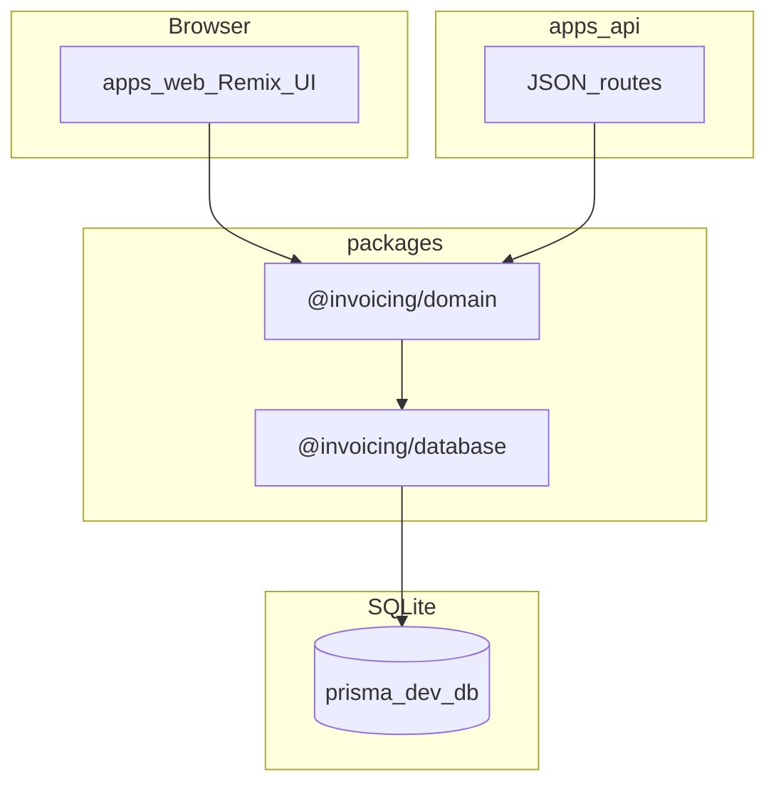

# Technical Design Document (TDD) — MVP Invoicing

**Status:** MVP implemented (gate G0–G5 Pass) · Phase 6 pending  
**Selarasan:** [../brd/architecture-alignment.md](../product/brd/architecture-alignment.md) · **Stack:** [technology-stack.md](technology-stack.md)\
**Indeks:** [../brd-definition-of-done.md](../product/brd-definition-of-done.md)\
**API spec:** [api.md](api.md)\
**Architecture:** [../ARCHITECTURE.md](../architecture/README.md)

---

## 1. Arsitektur logis (web + API)



| App | Port dev | Peran |
|-----|----------|--------|
| `@invoicing/web` | 44100 | HTML UI, form mutations, public `/i/:token` |
| `@invoicing/api` | 44101 | JSON REST untuk integrasi & UI headless (opsional) |

Keduanya memakai **`@invoicing/domain`** — business logic tidak duplikat di web/API.

---

## 2. Monorepo layout

```
Agentic/
├── apps/
│   ├── web/                 # Remix + Tailwind
│   └── api/                 # Remix router, JSON only
├── packages/
│   ├── database/            # Prisma schema + client
│   └── domain/              # auth, clients, invoices, invoiceTotals, pdf, email, session
└── docs/product/
```

---

## 3. Routing — Web (`@invoicing/web`)

| Route | Auth | FR | Layar design |
|-------|------|-----|--------------|
| `/` | Yes | FR-08 | Dashboard |
| `/login`, `/register` (GET/POST), `POST /logout` | No | Setup | Auth |
| `/clients`, `/clients/new`, `/clients/:clientId`, `/clients/:clientId/edit` | Yes | FR-01 | Klien, Detail klien |
| `/invoices` | Yes | FR-08 | Daftar invoice |
| `/invoices/new`, `/invoices/:invoiceId/edit` | Yes | FR-02–03 | Editor invoice |
| `/invoices/:invoiceId` | Yes | FR-04, FR-07 | Detail & preview |
| `GET /invoices/:invoiceId/pdf` | Yes | FR-04 | — |
| `POST /invoices/:invoiceId/send` | Yes | FR-05 | Alur kirim |
| `POST /invoices/:invoiceId/mark-paid` | Yes | FR-07 | — |
| `/i/:token` | No | FR-06 HTML | Public |
| `/settings` (GET/POST) | Yes | Profil, FR-10 | Settings |

File: [apps/web/app/routes.ts](../../apps/web/app/routes.ts)

---

## 4. Routing — API (`@invoicing/api`)

Implementasi saat ini + rencana: [api.md](api.md).

| Path | Status |
|------|--------|
| `/api/health/live`, `/api/health/ready` | Implemented |
| `/api/v1/status`, `/api/v1/dashboard`, `/api/v1/auth/*`, `/api/v1/profile` | Implemented |
| `/api/v1/clients` | Implemented |
| `/api/v1/invoices/*` (+ send, mark-paid, pdf, revoke-link) | Implemented |
| `/api/public/invoices/:token` | Implemented |

File: [apps/api/src/routes.ts](../../apps/api/src/routes.ts)

---

## 5. Database

**Package:** [packages/database](../../packages/database)\
**Schema:** [packages/database/prisma/schema.prisma](../../packages/database/prisma/schema.prisma)

Migrate dari root: `npm run db:migrate` (workspace `@invoicing/database`).

Domain rules di `@invoicing/domain`:

- `invoiceTotals.ts` — FR-03, BR-04 (implemented, 3 unit test)  
- `sendInvoice` — BR-02 nomor `INV-{YYYY}-{SEQ4}` + token (implemented; atomisitas: gap G-13)  
- `refreshOverdueInvoices` — BR-03 on-read (implemented)  
- `deleteInvoiceDraft` — BR-06 (implemented, API)  
- Cancel invoice — BR-01 (belum, gap G-01)  

---

## 6. Autentikasi

- Password: scrypt (`packages/domain/src/password.ts`)  
- Session: token HMAC (`packages/domain/src/session.ts`, `SESSION_SECRET` wajib di production)  
- **Web:** cookie `invoicing_session` HttpOnly SameSite=Lax (`apps/web/app/lib/session.ts`)  
- **API:** cookie yang sama atau `Authorization: Bearer`; endpoint FR return 401 tanpa session  

---

## 7. Email & PDF

Keduanya di `@invoicing/domain` agar web & API sama:

- PDF: `pdf.ts` (pdf-lib) — dipakai `GET /invoices/:id/pdf` dan API `.../pdf`  
- Email: `email.ts` — `setEmailSender(adapter)`; default log adapter; Resend untuk produksi (gap G-04)  

---

## 8. Environment

| Variable | Web | API |
|----------|-----|-----|
| `DATABASE_URL` | ✓ | ✓ (same file DB) |
| `PORT` | 44100 | 44101 |
| `API_BASE_URL` | ✓ (client fetch) | — |
| `CORS_ORIGIN` | — | web origin |
| `SESSION_SECRET` | ✓ | ✓ |
| `APP_URL` | ✓ (link publik email) | ✓ |
| `EMAIL_API_KEY`, `EMAIL_FROM` | ✓ (G-04) | ✓ (G-04) |

Daftar lengkap: [technology-stack.md](technology-stack.md) §5.

---

## 9. Sprint plan

Fase formal + gate pass: [development-phases.md](development-phases.md) · verifikasi: `npm run gate`

1. ✅ Phase 0 — Foundation  
2. ✅ Phase 1 — Auth + profil  
3. ✅ Phase 2 — FR-01 clients  
4. ✅ Phase 3 — FR-02–03 invoices + PPN  
5. ✅ Phase 4 — FR-04–06 PDF, email, public  
6. ✅ Phase 5 — FR-07–08 dashboard  
7. ⏳ Phase 6 — UAT manual + legal + CI green  

---

## 10. Risiko

| Risiko | Mitigasi |
|--------|----------|
| Duplikasi logic web/API | Wajib lewat `@invoicing/domain` |
| CORS prod | `CORS_ORIGIN` env |
| Nomor ganda saat kirim paralel | Transaksi + unique `(userId, number)` (G-13) |
| Email terkirim tapi DB gagal update | Commit dulu, email setelahnya / outbox (G-13) |

CI/CD & QA: [ARCHITECTURE.md](../architecture/README.md) §15–§17.
