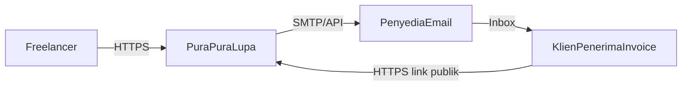
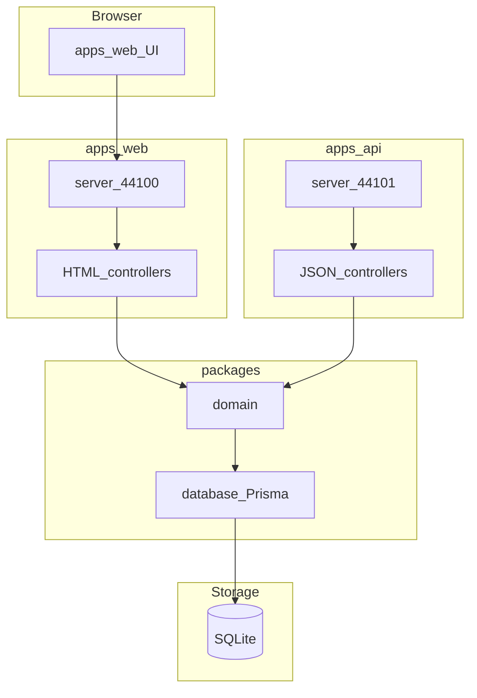
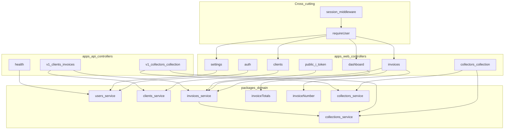
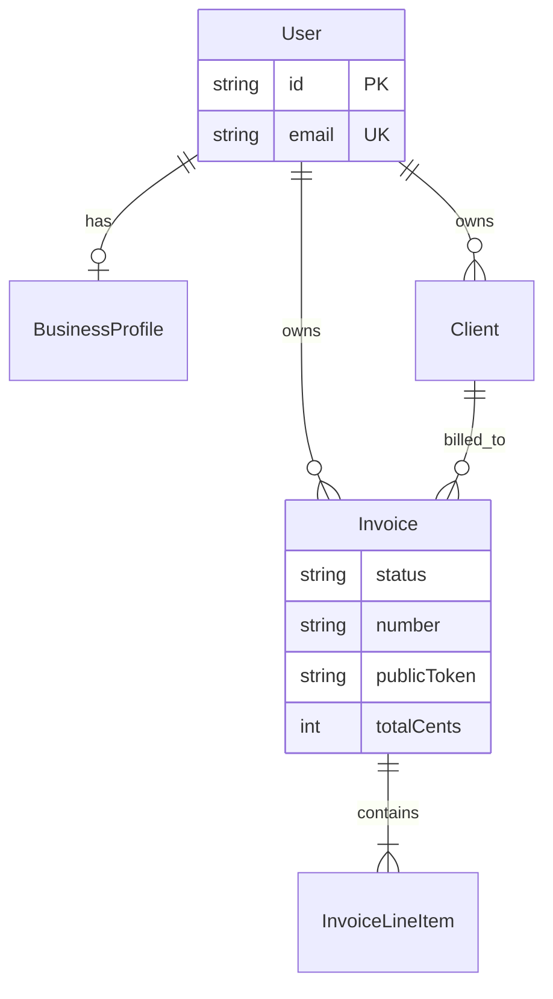
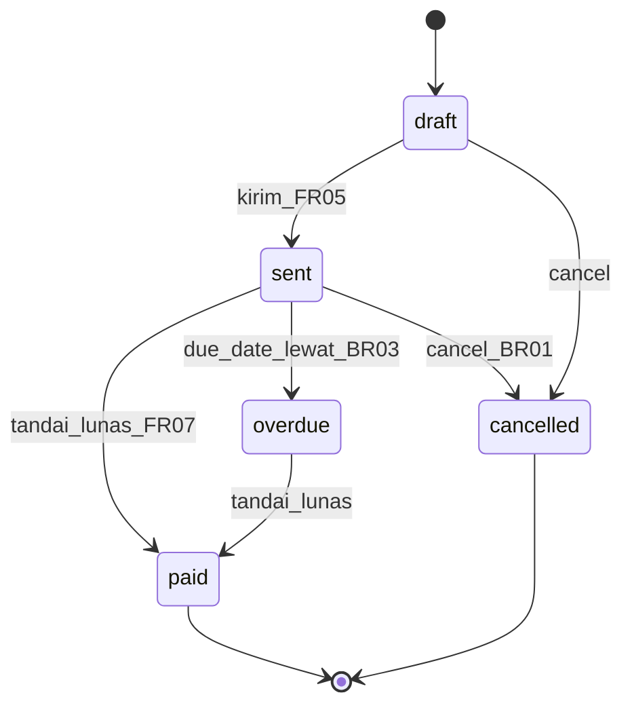
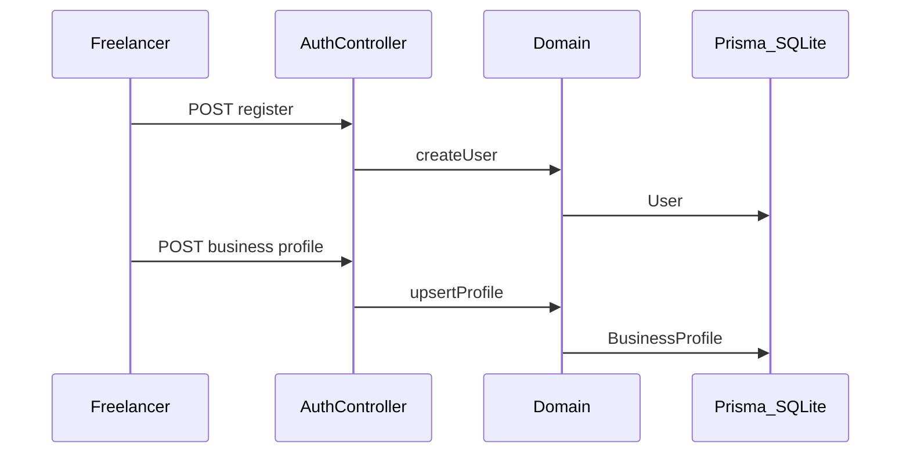
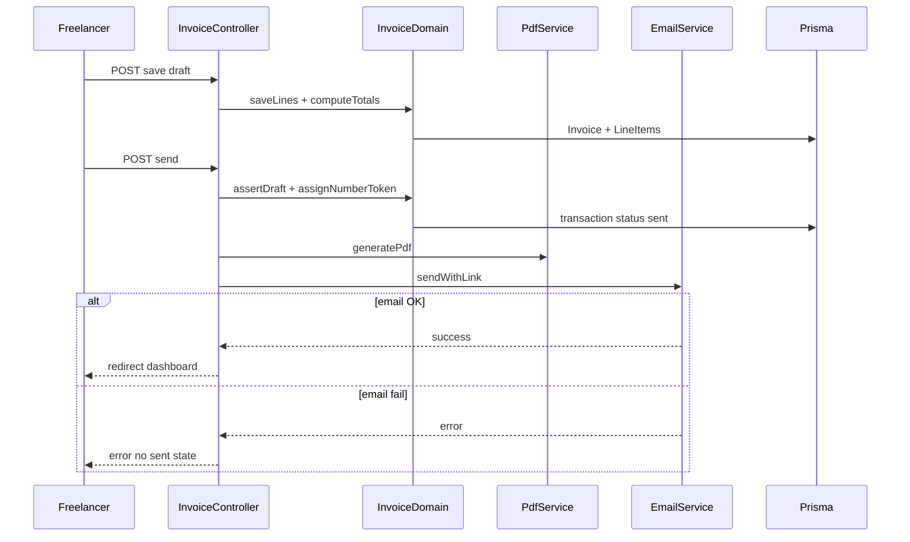
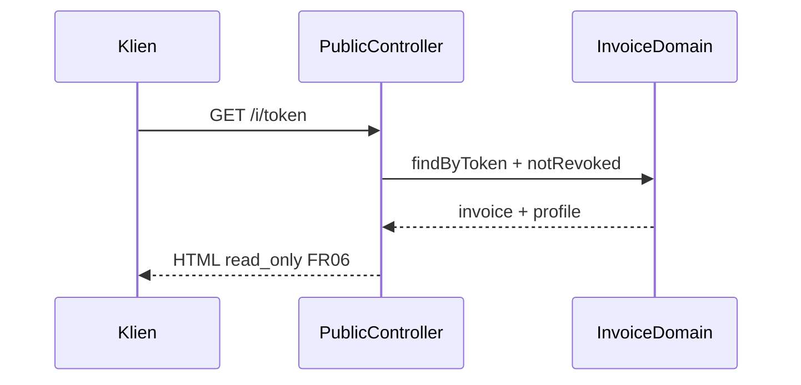
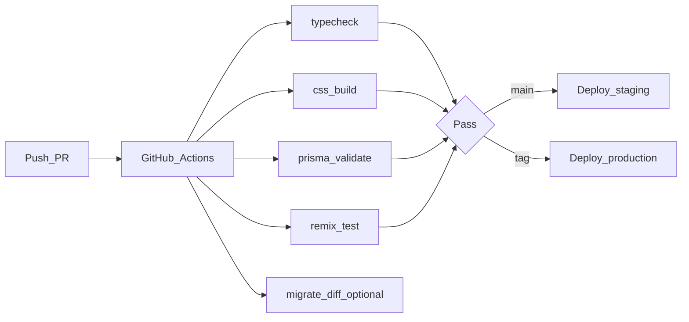
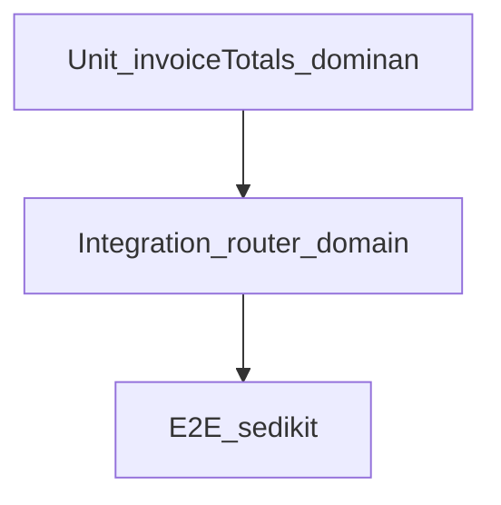

# System Architecture — PuraPuraLupa (Komando)

**Versi:** 1.6  
**Tanggal:** 2026-09-30  
**Indeks paket:** [BRD-DEFINITION-OF-DONE.md](./BRD-DEFINITION-OF-DONE.md)  
**Sumber BRD:** [BRD.md](./BRD.md) · [brd/MVP-SCOPE-LOCK.md](./brd/MVP-SCOPE-LOCK.md) · [brd/ARCHITECTURE-ALIGNMENT.md](./brd/ARCHITECTURE-ALIGNMENT.md) (keputusan canonical D-xx, gap G-xx)  
**Design:** [design/DESIGN-GUIDELINES.md](./design/DESIGN-GUIDELINES.md) · [prototype](../design/prototype/index.html)  
**Implementasi:** [apps/web](../../apps/web/) + [apps/api](../../apps/api/) + [packages/](../../packages/) — tanpa Docker  
**Detail engineering:** [engineering/TECHNICAL-DESIGN.md](./engineering/TECHNICAL-DESIGN.md), [engineering/API.md](./engineering/API.md), [engineering/STACK-INTEGRATION.md](./engineering/STACK-INTEGRATION.md)

---

## 1. Tujuan dokumen

Dokumen ini menjembatani **requirement bisnis (BRD)** dengan **struktur sistem** yang akan dibangun: batas domain, komponen, alur data, keamanan, dan pemetaan FR/BR ke modul aplikasi. Pembaca target: product, engineering, dan QA.

**Out of scope dokumen ini:** setup environment, build/deploy aplikasi, estimasi sprint detail, desain pixel-perfect (lihat [brd/WIREFRAMES.md](./brd/WIREFRAMES.md), [design/DESIGN-GUIDELINES.md](./design/DESIGN-GUIDELINES.md)).

---

## 2. Konteks produk (ringkas)

| Aspek | Keputusan |
|-------|-----------|
| Nama produk | **PuraPuraLupa** · Komisi Matel Indonesia (Komando) |
| Segmen | Freelancer/solo, Indonesia, IDR |
| Masalah | Invoice manual, tracking pembayaran terfragmentasi |
| MVP outcome | Profil bisnis → klien → invoice → PDF/link → email → lunas → dashboard → penagihan kolektor |
| North Star | Invoice terkirim / user aktif / minggu |
| Explicit non-goals MVP | e-Faktur, payment gateway, multi-user, multi-currency |

---

## 3. Stack ringkas

| Lapisan | Pilihan |
|---------|---------|
| Runtime | Node.js ≥ 24.3 · TypeScript strict |
| Apps | `@invoicing/web` (Remix 3 SSR + Tailwind v4) · `@invoicing/api` (JSON REST) |
| Shared | `@invoicing/domain` · `@invoicing/database` (Prisma) |
| DB | SQLite (dev/staging/prod) · Prisma 6 · volume persisten di host |
| Integrasi | PDF: **pdf-lib** (implemented) · Email: adapter domain, default log; **Resend** untuk produksi (gap G-04) |
| Auth | scrypt + session token HMAC (`SESSION_SECRET`), cookie `invoicing_session` / Bearer |
| UI design | Token semantik [DESIGN-GUIDELINES §13](./design/DESIGN-GUIDELINES.md#13-prototype-html) · light only MVP |

**Dokumen lengkap:** [engineering/TECHNOLOGY-STACK.md](./engineering/TECHNOLOGY-STACK.md) (diagram stack §1.1, FR mapping, env, dev/prod, trade-offs).

**Operasi dev:** [engineering/STACK-INTEGRATION.md](./engineering/STACK-INTEGRATION.md).

---

## 4. Prinsip arsitektur

1. **Monorepo modular** — `apps/web` + `apps/api` + `packages/*`; deployable terpisah, tanpa Docker wajib.
2. **Domain tunggal** — logic bisnis & BR hanya di `@invoicing/domain`; web/API controllers tipis.
3. **Server-first UI** — Remix render + form mutations di web; islands minimal ([brd/WIREFRAMES.md](./brd/WIREFRAMES.md)).
4. **Single tenant per akun** — satu user = satu bisnis (MVP); query scoped `userId` ([brd/MVP-SCOPE-LOCK.md](./brd/MVP-SCOPE-LOCK.md)).
5. **Immutable sent invoice** — BR-01/BR-02 di domain layer, bukan hanya UI.
6. **Trust boundaries** — session freelancer; token opaque klien (FR-06, BR-05).
7. **Pragmatic compliance** — PPN kalkulator; [legal/PPN-DISCLAIMER.md](./legal/PPN-DISCLAIMER.md).

---

## 5. Arsitektur konteks (C4 Level 1)



| Aktor | Interaksi |
|-------|-----------|
| Freelancer | Register, kelola klien/invoice, kirim, tandai lunas |
| Klien | Buka `/i/:token`, unduh PDF (tanpa akun) |
| Penyedia email | Deliver invoice + link |

---

## 6. Arsitektur container (C4 Level 2)



| Container | Path | Tanggung jawab |
|-----------|------|----------------|
| Web UI | `apps/web` | SSR, Tailwind, `/i/:token` HTML |
| Backend API | `apps/api` | JSON REST — [engineering/API.md](./engineering/API.md) |
| Domain | `packages/domain` | Business logic shared |
| Database | `packages/database` | Prisma schema & client |
| SQLite | `packages/database/prisma/*.db` | MVP persistence |

---

## 7. Arsitektur komponen aplikasi (C4 Level 3)



### 7.1 Peta modul → FR (MVP Must)

Selaras [brd/ARCHITECTURE-ALIGNMENT.md](./brd/ARCHITECTURE-ALIGNMENT.md) §3.

| FR | Web (`apps/web`) | API (`apps/api`) | Domain / BR |
|----|------------------|------------------|-------------|
| Setup | `auth/`, `settings/` | `/api/v1/auth/*`, `/api/v1/profile` | `User`, `BusinessProfile` |
| FR-01 | `clients/` | `/api/v1/clients` (CRUD; DELETE = nonaktifkan) | Clients · — |
| FR-02–03 | `invoices/` editor | `/api/v1/invoices` | Invoices · BR-04, FR-03 |
| FR-04 | `/invoices/:id` + `/invoices/:id/pdf` | `.../pdf` | `pdf.ts` (pdf-lib) |
| FR-05 | send action | `POST .../send` | email · BR-01, BR-02 |
| FR-06 | `/i/:token` | `/api/public/invoices/:token`, `.../revoke-link` | BR-05 |
| FR-07 | mark paid UI | `POST .../mark-paid` | BR-01 |
| FR-08 | `/` dashboard, `/invoices` list | `/api/v1/dashboard`, `/api/v1/invoices` | BR-03 overdue |
| FR-14 | `/collectors`, collection actions on invoice | `/api/v1/collectors`, `/api/v1/invoices/:id/collection/*` | `collectors.ts`, `collections.ts` · BR-07–BR-09 |
| FR-14h | `/collectors/:id/photo` | — (web only) | `collector-photos.ts` |

Status implementasi per baris + layar design: [brd/ARCHITECTURE-ALIGNMENT.md §3](./brd/ARCHITECTURE-ALIGNMENT.md#3-pemetaan-fr-must--arsitektur--stack--design).

---

## 8. Model domain & persistence

Entitas canonical: [packages/database/prisma/schema.prisma](../../packages/database/prisma/schema.prisma).



### 8.1 Lifecycle invoice (state machine)



| Transisi | Guard |
|----------|--------|
| → `sent` | Klien email valid; totals fresh; assign `number` (`INV-{YYYY}-{SEQ4}`) + `public_token` dalam satu transaksi, email setelah commit (G-13 implemented) |
| Edit line items | Hanya `draft` (BR-01) |
| → `paid` | Manual dari `sent`/`overdue`; set `paid_at`; tutup assignment kolektor + komisi (BR-08) |
| → `cancelled` | `cancelInvoice` dari `sent`/`overdue`; tutup assignment tanpa komisi |
| Hapus | Hard delete hanya `draft` (BR-06) |

### 8.2 Kalkulasi uang (FR-03, BR-04)

- Semua nominal disimpan **integer cents** (IDR).
- `subtotal` = Σ (qty × unit_price − discount) per baris.
- `ppn` = round(subtotal × rate) jika `ppn_enabled`.
- `total` = subtotal + ppn.
- Single source: `packages/domain` → `invoiceTotals.ts` (unit test 3 skenario [brd/USER-STORIES-UAT.md](./brd/USER-STORIES-UAT.md)).

---

## 9. Alur data utama

### 9.1 Onboarding & profil



### 9.2 Buat & kirim invoice



### 9.3 Klien lihat invoice publik



---

## 10. Arsitektur keamanan & privasi

| Layer | Kontrol MVP | NFR / legal |
|-------|-------------|-------------|
| Autentikasi | Email/password (scrypt), session token HMAC di cookie HttpOnly SameSite=Lax atau Bearer | [engineering/TECHNICAL-DESIGN.md](./engineering/TECHNICAL-DESIGN.md) §6 |
| Autorisasi | `userId` on every mutating query | Single-tenant |
| Public link | Token 24 byte random (base64url), revoke; rate limit + `noindex` planned (G-05) | FR-06, BR-05 |
| PII | Data klien milik user; [PRIVACY.md](./legal/PRIVACY.md) | Retention/hapus akun |
| Transport | TLS di production (reverse proxy) | — |
| CSRF | Form middleware / token | Planned pre-launch (G-05) |

---

## 11. Arsitektur integrasi

| Sistem | Arah | MVP | Konfig |
|--------|------|-----|--------|
| Email (adapter `setEmailSender`) | Outbound | Ya FR-05 — log adapter dev; Resend prod (G-04) | `EMAIL_API_KEY`, `EMAIL_FROM` |
| Payment gateway | — | Tidak | Fase 3 |
| DJP / e-Faktur | — | Tidak | Fase 5 |
| Object storage logo | Outbound | Opsional | URL di profile |

---

## 12. Arsitektur UI & navigasi

Selaras [brd/WIREFRAMES.md](./brd/WIREFRAMES.md) — layar inti + **Kolektor**, route = [apps/web/app/routes.ts](../../apps/web/app/routes.ts):

| Layar | Route | Stack UI | Prototype |
|-------|-------|----------|-----------|
| Dashboard | `/` | Tailwind layout + server render | `screen-dashboard.html` |
| Klien | `/clients`, `/clients/:id` | Forms + tables | `screen-clients.html`, `screen-client-detail.html` |
| Kolektor | `/collectors`, `/collectors/new`, `/collectors/:id(/edit)` | CRUD + foto (FR-14h) | Nav selaras app; detail via implementasi web |
| Daftar invoice | `/invoices` | Tabel + filter status & kolektor | `screen-invoice-list.html` |
| Editor invoice | `/invoices/new`, `/invoices/:id/edit` | Forms, PPN toggle + disclaimer | `screen-invoice-editor.html` |
| Detail & preview | `/invoices/:id` (+ `/pdf`, send, mark-paid, collection panel) | Mirror PDF + Penagihan | `screen-invoice-preview.html`, `screen-invoice-send.html`, `screen-invoice-locked.html` |
| Public | `/i/:token` | Minimal chrome | `screen-public.html`, `screen-pdf-states.html` |
| Settings | `/settings` | Profil + invoice defaults | `screen-settings.html` |

Auth: `/login`, `/register` (`screen-auth.html`). Visual & copy: [design/DESIGN-GUIDELINES.md](./design/DESIGN-GUIDELINES.md).

**Cascade CSS:** `@layer base, rmx, app` di [apps/web/app/styles/app.css](../../apps/web/app/styles/app.css) agar komponen `remix/ui` dan utility Tailwind coexist.

---

## 13. Arsitektur deployment (MVP → produksi)

| Lingkungan | App | DB | Email |
|------------|-----|-----|-------|
| Local | `npm run dev` | SQLite file | Mock / log |
| Staging | Node 24 container | Postgres | Sandbox domain |
| Production | Node 24 + health check | Postgres + daily backup | Verified domain SPF/DKIM |

Env matrix: [engineering/TECHNOLOGY-STACK.md](./engineering/TECHNOLOGY-STACK.md) §5.

---

## 14. Observability

### 14.1 Tujuan

Visibilitas cukup untuk debug MVP, deteksi outage, dan audit aksi kritis (kirim invoice, gagal email) tanpa stack observability penuh di hari pertama.

### 14.2 Logging (structured)

| Event | Level | Field minimum |
|-------|-------|----------------|
| HTTP request | info | `requestId`, `method`, `path`, `status`, `durationMs` |
| Auth login fail | warn | `requestId`, `emailHash` (bukan plain email) |
| Invoice send OK | info | `requestId`, `userId`, `invoiceId`, `sentAt` |
| Invoice send fail | error | `requestId`, `invoiceId`, `provider`, `errorCode` |
| PDF generate | info | `invoiceId`, `durationMs` |
| Public link abuse | warn | `requestId`, `ip`, `tokenPrefix` |

Format: **JSON lines** ke stdout (container-friendly). Production: agregasi via provider log (Fly/Railway/CloudWatch).

### 14.3 Health & readiness

| Endpoint | Purpose | Cek |
|----------|---------|-----|
| `GET /api/health/live` | Liveness | Process up |
| `GET /api/health/ready` | Readiness | Prisma `$queryRaw` + migrasi applied |

Health API: [apps/api/src/routes.ts](../../apps/api/src/routes.ts) (`/api/health/*`). Domain: [packages/domain/src/systemStatus.ts](../../packages/domain/src/systemStatus.ts).

### 14.4 Metrik (MVP → post-MVP)

| Metrik | MVP | Tool (rencana) |
|--------|-----|----------------|
| Request latency p95 | Log-derived | Dashboard host |
| Error rate 5xx | Log-derived | Alert threshold |
| Email send success | Counter log | Post-MVP: Prometheus/OpenTelemetry |
| PDF p95 | FR NFR &lt; 5s | Unit + log |

### 14.5 Tracing

MVP: **`requestId`** propagasi (header `X-Request-Id` atau generate per request). Post-MVP: OpenTelemetry span untuk send-invoice dan PDF.

### 14.6 Alerting (production)

- Ready check gagal &gt; 2 menit → page/on-call.
- Error rate 5xx &gt; 5% rolling 5 menit → investigate.
- Email provider error spike → cek DNS/ quota.

### 14.7 Operasi

- **Overdue:** on-read di list & dashboard (`refreshOverdueInvoices`); cron harian = post-MVP.
- **Backup DB:** snapshot harian prod; RPO 24 jam (NFR BRD).
- **Retention log:** 30 hari MVP; 90 hari post-launch jika compliance meminta.

---

## 15. CI/CD

### 15.1 Pipeline overview



### 15.2 Job CI (setiap PR & push ke `main`)

| Step | Perintah | Gate |
|------|----------|------|
| Install | `npm ci` | Wajib |
| Migrasi | `npm run db:migrate` (SQLite CI) | Wajib · ada di `ci.yml` |
| Unit/domain | `npm run test:domain` (`invoiceTotals`) | Wajib · ada di `ci.yml` |
| Typecheck | `npm run typecheck` (web, api, domain) | Wajib · ada di `ci.yml` |
| Gate FR | `npm run gate` (G0–G5) | Wajib · ada di `ci.yml` |
| CSS | `npm run css:build` | Direkomendasikan (G-09) |
| Router smoke | `npm test` (`controller.test.ts`) | Direkomendasikan (G-09) |

**Runner:** `ubuntu-latest`, **Node 24.x** (selaras `engines`).

### 15.3 CD (rencana)

| Trigger | Target | Langkah |
|---------|--------|---------|
| Merge `main` | Staging | Build image → deploy → `prisma migrate deploy` → smoke `GET /api/health/ready` |
| Git tag `v*.*.*` | Production | Manual approval gate → deploy → migrate → smoke |
| Rollback | Prod | Redeploy image sebelumnya; migrate rollback hanya jika `down.sql` aman |

Secrets di CI/CD: `DATABASE_URL`, `SESSION_SECRET`, `EMAIL_*`, `APP_URL` — **environment scoped** (staging ≠ prod).

### 15.4 Artefak build

- Tidak ada bundler terpisah: production = repo + `npm ci` + `css:build` + `prisma generate` di image.
- `.env` tidak masuk image; inject saat runtime.

### 15.5 Contoh workflow (referensi)

File aktual: [`.github/workflows/ci.yml`](../../.github/workflows/ci.yml). Contoh di bawah = target setelah G-09.

```yaml
# Ringkas — implementasi di repo terpisah
on: [pull_request, push]
jobs:
  verify:
    runs-on: ubuntu-latest
    steps:
      - uses: actions/checkout@v4
      - uses: actions/setup-node@v4
        with: { node-version: '24' }
      - run: npm ci
      - run: cp packages/database/.env.example packages/database/.env
      - run: npm run db:migrate
      - run: npm run test:domain
      - run: npm run typecheck
      - run: npm run gate
      - run: npm run css:build   # G-09
      - run: npm test            # G-09
```

---

## 16. Branch management

### 16.1 Model branching (trunk-based lean)

| Branch | Durasi hidup | Purpose |
|--------|--------------|---------|
| `main` | Permanen | Production-ready; dilindungi |
| `feature/*` | ≤ 3 hari ideal | Satu FR atau slice kecil (contoh `feature/fr-01-clients`) |
| `fix/*` | Pendek | Bugfix production atau staging |
| `release/*` | Opsional | Hanya jika freeze versi; otherwise tag dari `main` |

**Tidak** long-lived `develop` untuk MVP solo/small team — kurangi merge drift.

### 16.2 Aturan `main`

- PR wajib; **1 approval** (self-review OK untuk solo dev dengan checklist).
- CI hijau sebelum merge.
- Squash merge disarankan; pesan commit mengacu FR/US jika relevan (`feat(clients): FR-01 list + create`).

### 16.3 Versioning & tag

- **SemVer** untuk release user-facing: `v0.1.0` (MVP), `v0.2.0` (FR-09–11).
- Tag annoted + changelog ringkas di GitHub Release.

### 16.4 Environment ↔ branch

| Environment | Source deploy | DB |
|-------------|---------------|-----|
| Preview PR | Opsional (PR env) | Ephemeral SQLite / branch DB |
| Staging | `main` HEAD | Postgres staging |
| Production | Tag `v*` | Postgres prod |

---

## 17. Mekanisme QA

### 17.1 Piramida tes



| Lapisan | Scope | Tool | Frekuensi |
|---------|-------|------|-----------|
| Unit | `invoiceTotals`, numbering, token | `remix test` | Setiap PR |
| Integration | Router actions, Prisma in-memory/SQLite test DB | `remix test` | Setiap PR |
| E2E | Register → client → draft → send (mock email) | Playwright (post-MVP awal) | Nightly / pre-release |
| Manual | UAT checklist FR | Human | Sebelum tag MVP |

### 17.2 Traceability requirement → QA

Sumber kebenaran: [brd/USER-STORIES-UAT.md](./brd/USER-STORIES-UAT.md).

| Fase QA | Input | Output | Gate release |
|---------|-------|--------|--------------|
| Dev done | US Given/When/Then | Tes otomatis atau catatan manual | CI pass |
| QA staging | UAT-FR-01…08 + BR | Checklist signed | Semua Must Pass |
| Pre-prod | Smoke + legal placeholder review | Go/no-go | PM + eng |

### 17.3 Test data & environment

- **CI:** `DATABASE_URL=file:./test.db`; `prisma migrate deploy` atau push schema test.
- **Staging:** seed opsional 1 user demo; **tanpa** PII produksi.
- **Email:** staging = sandbox / log-only adapter; jangan kirim ke inbox nyata tanpa flag.

### 17.4 Defect workflow

1. Bug ditemukan → issue dengan label `severity` (S1–S3) + FR jika ada.
2. S1 (kirim invoice broken, auth bypass): hotfix `fix/*` → cherry-pick `main` → deploy.
3. Regresi wajib tes unit/integration sebelum close.

### 17.5 Non-functional QA

| NFR | Verifikasi |
|-----|------------|
| PDF p95 &lt; 5s | Load test ringkas staging |
| Dashboard p95 &lt; 2s | Lighthouse / k6 smoke |
| A11y dasar | Keyboard nav checklist per wireframe |
| Security | Public token rate limit; session cookie flags review |

---

## 18. Evolusi arsitektur (post-MVP)

| Fase | Capability | Dampak arsitektur |
|------|------------|-------------------|
| 2 | Reminder, recurring, partial pay | Job queue, template email |
| 3 | Payment link | Webhook ingress, idempotent `paid` |
| 4 | Export SPT / NPWP check | Batch export service |
| 5 | e-Faktur | Adapter terpisah, legal boundary |

Should/Could FR (09–13) masuk fase 2 tanpa mengubah core domain model.

---

## 19. Traceability BRD → arsitektur

| Artefak BRD | Refleksi di arsitektur |
|-------------|------------------------|
| Selaras BRD ↔ arch ↔ stack ↔ design | [brd/ARCHITECTURE-ALIGNMENT.md](./brd/ARCHITECTURE-ALIGNMENT.md) |
| FR-01–FR-08 | §7.1 + alignment §3 |
| BR-01–BR-06 | §8.1 + alignment §4 |
| MoSCoW | [brd/MVP-SCOPE-LOCK.md](./brd/MVP-SCOPE-LOCK.md) |
| NFR keamanan/perf | §10, §14, §17.5 |
| User story map | [brd/USER-STORY-MAP.md](./brd/USER-STORY-MAP.md) ↔ §9 |
| Wireframes + design | [brd/WIREFRAMES.md](./brd/WIREFRAMES.md), [design/DESIGN-GUIDELINES.md](./design/DESIGN-GUIDELINES.md) ↔ §12 |
| Technology stack | [engineering/TECHNOLOGY-STACK.md](./engineering/TECHNOLOGY-STACK.md) ↔ §3 |
| UAT | [brd/USER-STORIES-UAT.md](./brd/USER-STORIES-UAT.md) ↔ §17 |
| Legal PPN | [legal/PPN-DISCLAIMER.md](./legal/PPN-DISCLAIMER.md) ↔ §4 prinsip 7, §12 |
| CI/CD & branch | §15, §16 |

---

## 20. Status dokumentasi vs implementasi

| Area | Dokumen | Kode |
|------|---------|------|
| BRD & MoSCoW | Selesai | — |
| System architecture + API spec | Selesai | — |
| Monorepo web + API + packages | TDD selesai | Implemented |
| Health / readiness | §14 | Implemented (`@invoicing/api`) |
| Fitur FR-01–FR-08 | UAT siap | Implemented (gate G0–G5 Pass); UAT manual pending |
| CI | §15 | Implemented (`ci.yml`); CD planned |
| Security pre-launch (CSRF, rate limit, noindex) | §10 | Planned (G-05) |
| Gap lain | [alignment §6](./brd/ARCHITECTURE-ALIGNMENT.md#6-register-gap-dokumen--kode) | G-01…G-13 |

**Shared rule:** logic bisnis hanya di `@invoicing/domain`; web dan API tidak duplikasi Prisma langsung.

---

## 21. Referensi dokumen

| Dokumen | Peran |
|---------|--------|
| [BRD-DEFINITION-OF-DONE.md](./BRD-DEFINITION-OF-DONE.md) | Indeks paket dokumentasi |
| [BRD.md](./BRD.md) | BRD canonical |
| [brd/PRODUCT-BRIEF.md](./brd/PRODUCT-BRIEF.md) | Visi & batas MVP |
| [brd/MVP-SCOPE-LOCK.md](./brd/MVP-SCOPE-LOCK.md) | FR/BR locked |
| [brd/ARCHITECTURE-ALIGNMENT.md](./brd/ARCHITECTURE-ALIGNMENT.md) | Hub selarasan BRD ↔ arch ↔ stack ↔ design |
| [design/DESIGN-GUIDELINES.md](./design/DESIGN-GUIDELINES.md) | Design guidelines + prototype |
| [ARCHITECTURE.md](./ARCHITECTURE.md) | **Dokumen ini** — system architecture |
| [engineering/TECHNICAL-DESIGN.md](./engineering/TECHNICAL-DESIGN.md) | TDD monorepo |
| [engineering/API.md](./engineering/API.md) | Backend JSON API |
| [engineering/TECHNOLOGY-STACK.md](./engineering/TECHNOLOGY-STACK.md) | Technology stack |
| [engineering/STACK-INTEGRATION.md](./engineering/STACK-INTEGRATION.md) | Dev & env |

**Pemeliharaan:** Perbarui §20 saat fase bergeser dari dokumentasi ke implementasi; sinkronkan diagram modul dengan `apps/web/app/actions/*`.
