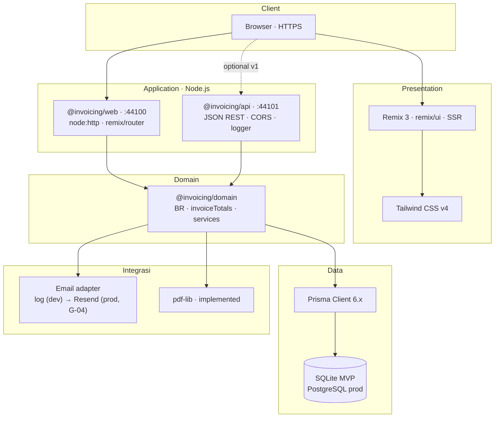
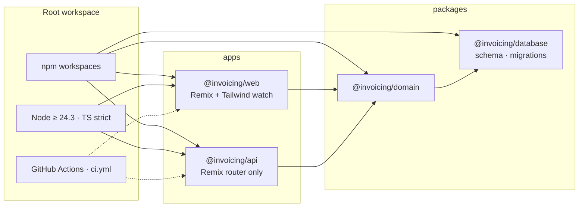
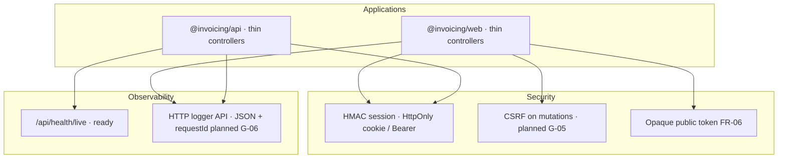
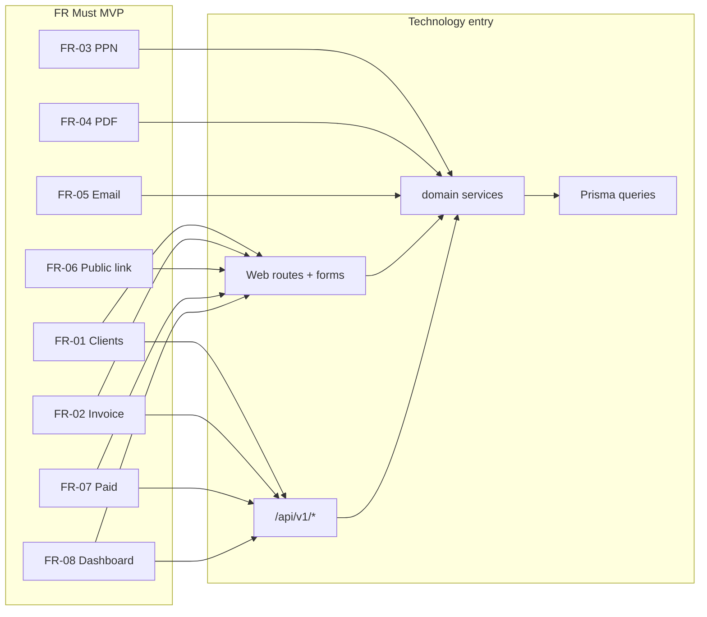

# Technology Stack — Invoicing MVP

**Versi:** 1.2 · **Tanggal:** 2026-09-29  
**Sumber:** [BRD.md](../BRD.md) · [ARCHITECTURE.md](../ARCHITECTURE.md) v1.5 · [brd/MVP-SCOPE-LOCK.md](../brd/MVP-SCOPE-LOCK.md) · [design/DESIGN-GUIDELINES.md](../design/DESIGN-GUIDELINES.md)  
**Pemetaan FR & keputusan canonical:** [brd/ARCHITECTURE-ALIGNMENT.md](../brd/ARCHITECTURE-ALIGNMENT.md) (D-07 PDF, D-08 email, D-09 auth, D-10 tokens)

Dokumen ini merangkum **teknologi yang dipilih** untuk MVP freelancer invoicing (Indonesia, IDR), selaras requirement dan arsitektur monorepo **tanpa Docker wajib**.

---

## 1. Ringkasan eksekutif

| Dimensi | Pilihan |
|---------|---------|
| Bahasa | TypeScript (strict) |
| Runtime | Node.js ≥ 24.3 (ESM) |
| Arsitektur app | Monorepo npm workspaces: web + API + shared packages |
| UI | Remix 3 RC (SSR, `remix/ui`) + Tailwind CSS v4 · token semantik design (konvensi shadcn/ui, tanpa React) |
| API | Remix router, JSON REST |
| Data | Prisma ORM 6 · SQLite (dev/MVP) → PostgreSQL (prod) |
| Integrasi | PDF **pdf-lib** · email adapter (log → Resend) · auth `node:crypto` (scrypt, HMAC) |
| Deploy | Node process langsung atau container opsional (Fly/Railway/VPS) |

**Explicitly out (Won't — BRD):** e-Faktur/Coretax, payment gateway, multi-user RBAC, multi-currency, mobile native.

### 1.1 Diagram stack

#### Lapisan teknologi (logical)

Alur dari browser ke persistence dan layanan eksternal — selaras [ARCHITECTURE.md](../ARCHITECTURE.md) §6–7.



#### Monorepo & dependensi workspace



#### Cross-cutting pada stack MVP



#### Pemetaan FR Must → entry stack



---

## 2. Stack per lapisan

### 2.1 Platform & tooling

| Komponen | Teknologi | Versi / catatan |
|----------|-----------|-----------------|
| Runtime | Node.js | ≥ 24.3 (`engines` monorepo) |
| Package manager | npm | workspaces `apps/*`, `packages/*` |
| Bahasa | TypeScript | `strict`, `module: NodeNext` |
| TS execution | `remix/node-tsx` | Dev & prod server |
| VCS | Git | Trunk-based ([ARCHITECTURE](../ARCHITECTURE.md) §16) |
| CI | GitHub Actions | `.github/workflows/ci.yml` — migrate, test:domain, typecheck, gate ([ARCHITECTURE](../ARCHITECTURE.md) §15) |

### 2.2 Aplikasi — Web (`@invoicing/web`)

| Komponen | Teknologi | Mendukung FR / NFR |
|----------|-----------|-------------------|
| Framework | Remix 3 RC (`remix@^3.0.0-rc.4`) | Server-first UI, forms |
| HTTP | `node:http` + `remix/node-fetch-server` | — |
| Routing | `remix/router` + `remix/routes` | Dashboard, CRUD pages |
| UI runtime | `remix/ui` | Components, `clientEntry` islands |
| Styling | Tailwind CSS v4 (`@tailwindcss/cli` ^4.1) | Wireframes, a11y utility |
| Design tokens | CSS variables semantik (`--primary`, `--muted`, …) + `@theme inline` — sumber `docs/design/prototype/src/tailwind.css` | [DESIGN-GUIDELINES](../design/DESIGN-GUIDELINES.md) §13; adopsi ke `app.css`: gap G-07 |
| CSS pipeline | Source `app/styles/app.css` → `public/app.css` | `@layer base, rmx, app` |
| Static assets | `remix/middleware/static` + asset server | Favicon, CSS |
| Port dev | 44100 | — |

**FR utama via web:** FR-01–FR-08 (UX freelancer), FR-06 HTML `/i/:token`. Route canonical: [ARCHITECTURE](../ARCHITECTURE.md) §12.

### 2.3 Aplikasi — Backend API (`@invoicing/api`)

| Komponen | Teknologi | Mendukung FR / NFR |
|----------|-----------|-------------------|
| Framework | Remix 3 RC (router only, no SSR UI) | JSON API |
| HTTP | `node:http` + `remix/node-fetch-server` | — |
| Middleware | `remix/middleware/cors`, `logger` | Integrasi web, observability |
| Format | JSON (`Content-Type: application/json`) | v1 REST |
| Port dev | 44101 | — |
| Spesifikasi route | [API.md](./API.md) | Parity FR dengan web |

**FR via API:** health/readiness; v1 auth, profile, dashboard, clients, invoices (send, mark-paid, pdf, revoke-link), public — mirror domain yang sama dengan web.

### 2.4 Shared packages

| Package | Teknologi | Isi |
|---------|-----------|-----|
| `@invoicing/database` | Prisma 6.x (`^6.16`) | Schema, migrations, `PrismaClient` singleton |
| `@invoicing/domain` | TypeScript + `pdf-lib` + `node:crypto` | `auth`, `clients`, `invoices`, `invoiceTotals`, `pdf`, `email`, `session`, `password`, `profile`, `systemStatus` |

**Aturan arsitektur:** web/API tidak duplikasi invariant BR — konsumsi `@invoicing/domain`.

### 2.5 Data & persistence

| Lingkungan | Database | ORM | Lokasi schema |
|------------|----------|-----|---------------|
| Local / MVP | SQLite (`file:./prisma/dev.db`) | Prisma | `packages/database/prisma/` |
| Production | PostgreSQL | Prisma (provider switch) | Same schema |

**Entitas (BRD domain model):** User, BusinessProfile, Client, Invoice, InvoiceLineItem — [ARCHITECTURE](../ARCHITECTURE.md) §8.

| FR/BR | Mekanisme stack |
|-------|-----------------|
| FR-02, FR-03 | Prisma models + domain `invoiceTotals` |
| BR-02 send | Prisma `$transaction` di domain |
| FR-08 aggregates | Prisma queries scoped `userId` |

### 2.6 Cross-cutting — Auth & security

| Concern | Teknologi | Status | FR/NFR |
|---------|-----------|--------|--------|
| Password hash | **scrypt** (`node:crypto`) | Implemented | Setup |
| Session | Token HMAC (`SESSION_SECRET`), cookie `invoicing_session` HttpOnly SameSite=Lax; API juga `Bearer` | Implemented | Web + API |
| CSRF | Remix CSRF middleware | Planned (G-05) | Mutations web |
| Public invoice | Opaque token `randomBytes(24)` base64url + `publicTokenRevokedAt` | Implemented | FR-06, BR-05 |
| Rate limit | Middleware / reverse proxy | Planned (G-05) | Public link NFR |
| TLS | Reverse proxy (prod) | Transport |

### 2.7 Cross-cutting — Email & PDF

| Capability | Teknologi | Status | FR |
|------------|-----------|--------|-----|
| Email outbound | Adapter `setEmailSender` di domain; default log adapter; **Resend** untuk produksi | Adapter implemented; provider planned (G-04) | FR-05 |
| PDF generate | **pdf-lib** (`StandardFonts`) | Implemented — keputusan final MVP (HTML→PDF ditolak: berat) | FR-04 |
| Template | Server-side HTML/string + domain data | Implemented (email minimal) | Logo, IDR format |

Failure policy (BRD): email gagal → jangan set `sent` ([ARCHITECTURE](../ARCHITECTURE.md) §9.2).

### 2.8 Observability & ops

| Area | Teknologi / pola | Referensi |
|------|------------------|-----------|
| Logs | `remix/middleware/logger` (API); JSON stdout planned (G-06) | ARCHITECTURE §14 |
| Health | `/api/health/live`, `/api/health/ready` | `@invoicing/api` |
| Request ID | Header / middleware | ARCHITECTURE §14.5 |
| Metrics | Log-derived MVP; OTel post-MVP | — |
| DB backup | Provider snapshot (prod) | RPO 24h NFR |

### 2.9 Frontend tooling (web only)

| Tool | Purpose |
|------|---------|
| `concurrently` | Dev: Tailwind watch + Remix server |
| Remix test (`remix/test`) | Router smoke web (`npm test`) |
| `node --test` + `tsx` | Unit domain `invoiceTotals` (`npm run test:domain`) |
| Gate script | `npm run gate` — G0–G5 integrasi API ([DEVELOPMENT-PHASES](./DEVELOPMENT-PHASES.md)) |
| Tailwind CLI (root) | `npm run design:css` — build prototype design system |
| `tsc --noEmit` | Typecheck CI |

---

## 3. Pemetaan FR Must → komponen stack

| FR | Web | API | Domain | Infra/services |
|----|-----|-----|--------|----------------|
| FR-01 | `/clients` UI | `/api/v1/clients` | client service | Prisma `Client` |
| FR-02 | invoice editor | `/api/v1/invoices` | invoice service | Prisma `Invoice` + lines |
| FR-03 | PPN toggle UI + disclaimer | JSON fields | `invoiceTotals` | — |
| FR-04 | `/invoices/:id` + `/pdf` | `.../pdf` | `pdf.ts` | pdf-lib |
| FR-05 | send button | `POST .../send` | `sendInvoice` | email adapter → Resend |
| FR-06 | `/i/:token` HTML | `/api/public/invoices/:token` | token lookup | — |
| FR-07 | mark paid UI | `POST .../mark-paid` | status update | Prisma |
| FR-08 | `/`, `/invoices` | `/api/v1/dashboard`, `/api/v1/invoices` | queries | Prisma |

Detail: [ARCHITECTURE-ALIGNMENT.md](../brd/ARCHITECTURE-ALIGNMENT.md) §3.

---

## 4. Monorepo layout

```
Agentic/
├── apps/
│   ├── web/          @invoicing/web   Remix SSR + Tailwind
│   └── api/          @invoicing/api   JSON REST
├── packages/
│   ├── database/     @invoicing/database   Prisma
│   └── domain/       @invoicing/domain     Business logic
├── docs/invoicing/   BRD + ARCHITECTURE + engineering + design
└── docs/design/prototype/   HTML design system (Tailwind v4)
```

Workspace root: [package.json](../../../package.json).

---

## 5. Environment variables

| Variable | Dipakai oleh | Wajib MVP |
|----------|--------------|-----------|
| `DATABASE_URL` | database, web, api | Ya |
| `PORT` | web (44100), api (44101) | Opsional |
| `SESSION_SECRET` | domain `session.ts` (web + api) | Ya di production (throw jika kosong) |
| `EMAIL_API_KEY`, `EMAIL_FROM` | adapter Resend (G-04) | Ya sebelum prod |
| `APP_URL` | link publik di email (default `http://localhost:44100`) | Ya di production |
| `CORS_ORIGIN` | api | Dev: web origin |
| `API_BASE_URL` | web (fetch API opsional) | Opsional |

---

## 6. Dev vs production

| Aspek | Development | Production |
|-------|-------------|------------|
| Database | SQLite file | PostgreSQL managed |
| Process | `npm run dev` (web+api) | `npm run start:web`, `start:api` |
| Docker | Tidak wajib | Opsional |
| Email | Log adapter (default) | Resend, verified domain SPF/DKIM |
| CSS | Tailwind watch | Prebuilt `public/app.css` |
| Node | ≥ 24.3 lokal | Same di hosting |

Operasi: [STACK-INTEGRATION.md](./STACK-INTEGRATION.md).

---

## 7. Stack fase lanjut (post-MVP, BRD backlog)

| Fase BRD | Capability | Teknologi kandidat |
|----------|------------|-------------------|
| 2 | Reminder, recurring | Job queue (cron / BullMQ) + email |
| 3 | Payment link | Midtrans/Xendit SDK + webhooks |
| 4 | Export pajak informasi | CSV/Excel generation |
| 5 | e-Faktur | Adapter terpisah, partner pajak — **bukan** perluasan stack MVP |

---

## 8. Keputusan & trade-off

| Keputusan | Alasan | Trade-off |
|-----------|--------|-----------|
| Remix untuk web **dan** API | Satu mental model router, tim kecil | Bukan Express/Fastify murni |
| SQLite MVP | Zero ops lokal, cepat validasi | Migrate ke Postgres sebelum scale |
| Tailwind v4 + token semantik | Utility cepat, selaras wireframe & prototype | Konvensi shadcn tanpa React; komponen = resep class |
| pdf-lib | Ringan, tanpa browser headless | Layout PDF manual (bukan HTML→PDF) |
| scrypt bawaan Node | Tanpa dependensi native | Parameter perlu di-review sebelum prod |
| Email adapter | Tes & dev tanpa provider | Provider nyata wajib sebelum prod (G-04) |
| Domain package | BR-01–06 satu tempat | Perlu disiplin boundary |
| Tanpa Docker dev | Sesuai BRD Indonesia freelancer MVP | Paritas prod via Postgres + env |

---

## 9. Referensi

| Dokumen | Isi |
|---------|-----|
| [ARCHITECTURE.md](../ARCHITECTURE.md) | C4, CI/CD, QA, observability |
| [TECHNICAL-DESIGN.md](./TECHNICAL-DESIGN.md) | TDD routes & sprint |
| [API.md](./API.md) | Endpoint API |
| [STACK-INTEGRATION.md](./STACK-INTEGRATION.md) | Perintah dev |
| [BRD.md](../BRD.md) | Requirement bisnis |
| [brd/ARCHITECTURE-ALIGNMENT.md](../brd/ARCHITECTURE-ALIGNMENT.md) | Keputusan canonical + gap register |
| [design/DESIGN-GUIDELINES.md](../design/DESIGN-GUIDELINES.md) | Design system & token |

**Maintenance:** jika stack berubah (mis. PDF lib final), update file ini, diagram §1.1, dan ARCHITECTURE §3 ringkas.
