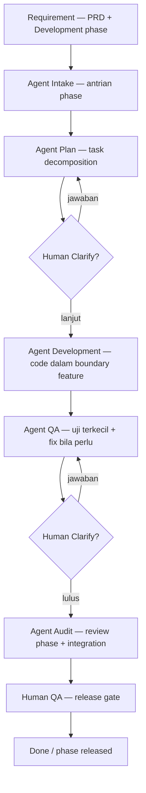
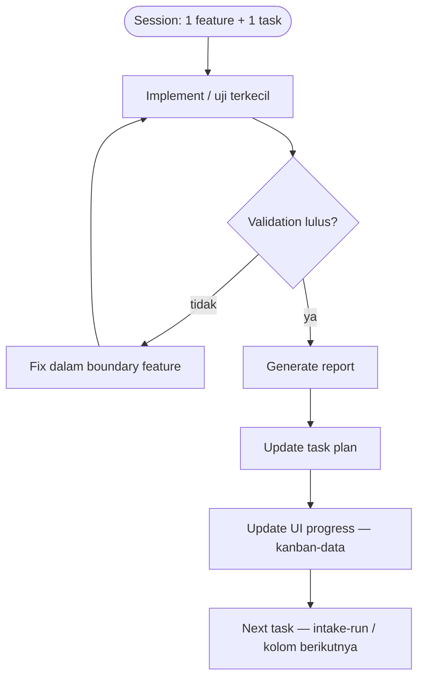

# Agentic Software Development Framework

Orkestrasi **deterministic & traceable** untuk coding agent: planning sampai **task-level** sebelum implementasi; ambigu → **Human Clarify**; development **1 session = 1 feature + 1 task** (semua file terkait); setiap task selesai wajib **validate → report → update plan → progress UI → next task**.

Stack produk (contoh repo ini): **web + API** monorepo (`apps/web`, `apps/api`, packages) — boundary file dicatat di feature doc, bukan “prompt lalu coding”.

## Alur makro (requirement → release)

| Tahap framework | Agent / gate | Artefak kebenaran |
|-----------------|--------------|-------------------|
| Requirement | Human + PRD | `docs/product/requirements/**`, `*_Development_phase.md` |
| Planner | Agent Intake + Plan | `intake-queue.json`, `plan.md`, `skills/*.md`, feature doc |
| Human Clarification Gate | Human Clarify | `docs/workflow/plans/clarify/` |
| Development | Agent Development | `docs/workflow/results/.../development/{task}.md`, section Development di plan |
| Code / test / validate | Agent QA (+ dev fix) | `docs/workflow/results/.../qa/{task}.md` |
| Review | Agent Audit (per phase) | `audit/report.md`, update PRD |
| Progress dashboard | Kanban + scripts | `kanban-board.json`, `agentic:kanban-data` |
| Next task | Orchestrator | `agentic:intake-run`, validate-* scripts |

## Loop mikro per task (Development / QA)

| Langkah | Development | QA |
|---------|-------------|-----|
| Validation | `npm run agentic:validate-dev` | `npm run agentic:validate-qa` |
| Report | `docs/workflow/results/.../development/` | `docs/workflow/results/.../qa/` |
| Update plan | Section **Development** | Section **QA** |
| Progress | `npm run agentic:kanban-data` | sama |
| Next | Task berikutnya di phase (Plan sudah `defined`) | Task QA berikutnya; phase → Audit bila semua pass |

## Prinsip inti

1. **Planning gate** — tidak ada Development sebelum plan task + skill files + feature doc.
2. **Execution boundary** — hanya path di `docs/workflow/features/{id}.md` (+ Files PRD).
3. **Human decision gate** — `needs_clarify` menghentikan automasi sampai ada jawaban.
4. **Audit trail** — chat bukan sumber keadaan; file plan, result, queue, git commit (audit).
5. **Progress tracking** — kanban + `%` per task/phase dari artefak repo.

## Entry point operasional

| Perintah | Fungsi |
|----------|--------|
| `npm run agentic:intake-run -- next` | Task/plan berikutnya (Intake/Plan) |
| `npm run agentic:trigger-next` | Langkah orkestrasi berikutnya (Intake → Plan → Development): prompt agent + opsi `--execute` |
| `npm run agentic:autopilot` | Task belum done **terkecil** (urutan epic/phase/task) → `.agentic/trigger/AGENT_PROMPT.md` |
| `npm run agentic:autopilot:watch` | Poll; saat Development selesai (`complete` + validate-dev), **siapkan prompt** task berikutnya |
| `npm run agentic:daemon` | **Jalankan di terminal:** autopilot watch + refresh kanban/monitoring (tetap butuh Cursor Agent untuk kode) |

**Mengapa task “running” tidak jalan sendiri?** Tombol trigger / autopilot **tidak** memanggil Cursor Agent dari browser atau npm (kecuali langkah mekanis Intake dengan `--auto-mechanical`). Status **assigned** = prompt sudah ditulis; **running** = `plan.md` status `in_progress`. Alur: `npm run agentic:daemon` → buka chat Agent dengan isi `Agentic/.agentic/trigger/AGENT_PROMPT.md` → setelah selesai: `npm run agentic:autopilot -- complete --task <id>`.
| `npm run agentic:validate-dev` / `-qa` / `-audit` | Gate sebelum handoff |
| `npm run agentic:kanban-data` | Refresh dashboard |
| `npm run agentic:bootstrap-plans` | Buat/rapikan `plan.md` + `skills/` untuk semua task di intake-queue (dari catalog PRD) |
| `npm run agentic:task-checklist` | Checklist 138 task: running / ready / waiting / blocked + alasan (JSON + markdown) |
| UI checklist | `docs/workflow/dashboard/task-checklist.html` (serve kanban port 3456) |
| `npm run agentic:monitoring-data` | Snapshot status task + log (autopilot, laporan Result) → `data/monitoring.json` |
| UI monitoring | `docs/workflow/dashboard/monitoring.html` |

Spesifikasi lengkap: [docs/product/requirements/0800-orkestrasi-stage/0800_PRD_Orkestrasi_Stage.md](../product/requirements/0800-orkestrasi-stage/0800_PRD_Orkestrasi_Stage.md) · skills: [skill/README.md](skills/README.md).
